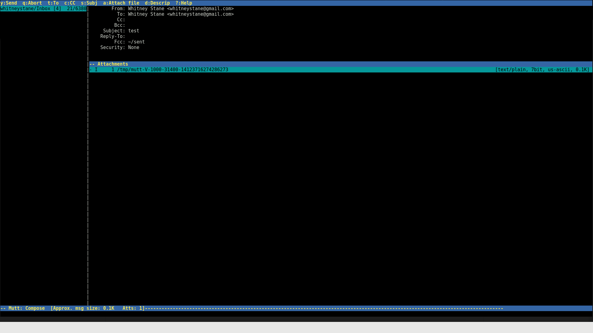
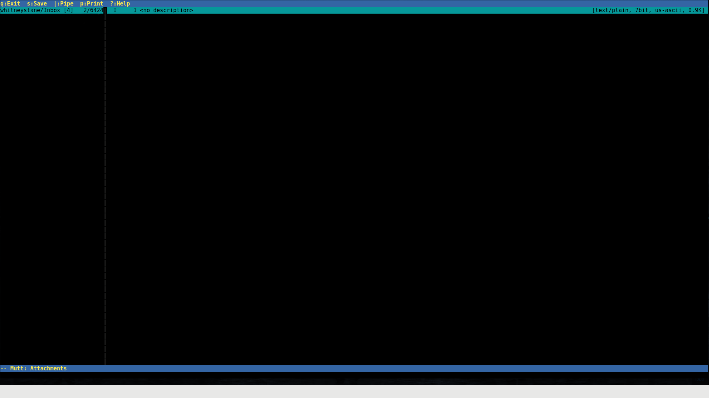

# KeybaseMutt

A work in progress. KeybaseMutt exists to let its users utilize Keybase within neomutt. (Unfortunately, not natively (yet).)

## Quick start

Run the install script. It will set up the directory's and paths for you. Do what it says or suffer the consequences!

Then just throw these into your .muttrc

`set editor = 'echo %s > ~/.neomutt/keybaseMutt/.tmp; vim %s'`

`macro compose K "<enter-command>unset wait_key<enter><shell-escape>python ~/.neomutt/keybaseMutt/keybase.py<enter><enter-command>set wait_key<enter>`

Done!

## How to use KeybaseMutt

Write an email. In the screen right before you send your email (called the pager mode), press "K".

(Press 'K' when you're here)

You can now use four Keybase commands in this "shell". (I thought it best to limit the user to four commands for security reasons. Running unusual commands would overwrite the email, forcing the user to rewrite the email again.)

The commands are:
- `keybase encrypt [user]`
- `keybase pgp encrypt [user]`
- `keybase sign`
- `keybase pgp sign`

## Decrypting and verifying messages

Unfortunately, there isn't an easy way to decrypt or verify messages through a macro. Instead, you'll need to use the pipe feature of neomutt.

Opening the email, you'll need to navigate to the actual attachment. (Press "V" when you're reading the email.)

Then pipe ("|") it through the one of the scripts. (like "pgpverify.sh" or "decrypt.sh")

Please note, using an attachment is very important when decrypting emails that include html. The scripts are unable to separate html and text.

Make sure that the attachment is "text/plain" rather than "text/html".
